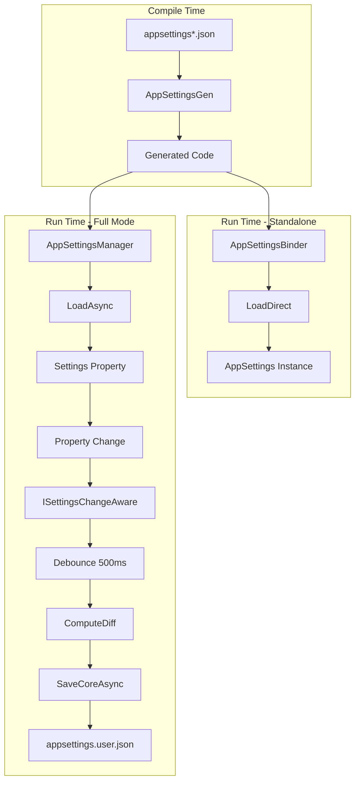
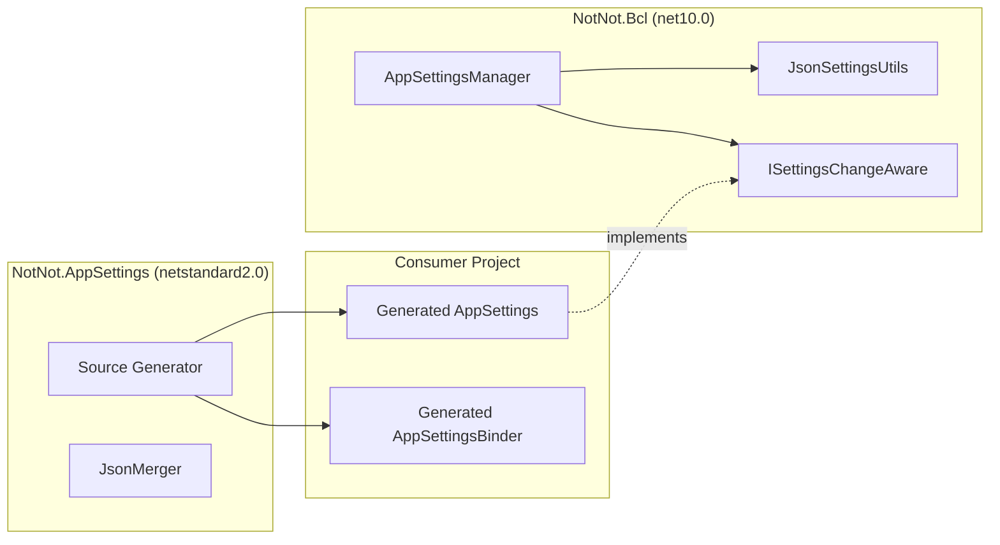
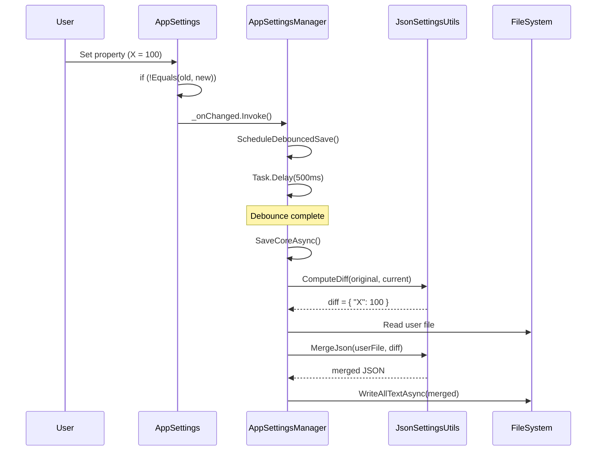

# NotNot.AppSettings - Product Requirements Document

## 1. Purpose & Business Value

### Vision
Provide .NET developers with zero-configuration, strongly-typed access to `appsettings.json` files via source generation, with optional runtime save/auto-save capabilities.

### Value Proposition
- **Zero boilerplate**: No manual POCO classes or binding code
- **Compile-time safety**: JSON schema changes caught at build time
- **Layered configuration**: Multiple JSON files merged automatically
- **Optional persistence**: Opt-in save/auto-save for desktop applications

---

## E2E User Scenarios

### APPSETTINGS_E2E_001: Developer Adds Strongly-Typed Settings (Read-Only)
**AC-ID**: `APPSETTINGS_E2E_001_READONLY`

**Given**: Developer has a .NET project with `appsettings.json`:
```json
{
  "Database": {
    "ConnectionString": "Server=localhost;Database=MyApp"
  },
  "Logging": {
    "Level": "Debug"
  }
}
```

**When**: Developer:
1. Installs `NotNot.AppSettings` NuGet package
2. Marks JSON as AdditionalFiles: `<AdditionalFiles Include="appsettings.json" />`
3. Builds project

**Then**:
1. Source generator creates `{RootNamespace}.AppSettingsGen.AppSettings` class
2. Nested classes created for each JSON object (`Database`, `Logging`)
3. Properties match JSON structure with appropriate types
4. Developer accesses: `var settings = AppSettingsBinder.LoadDirect();`
5. IntelliSense works: `settings.Database.ConnectionString`

**E2E Test**: [`AppSettingsManagerTests.cs#L76-86`](../NotNot.AppSettings.Tests/AppSettingsManagerTests.cs#L76)
**Validation**: Build succeeds, IntelliSense available, values correct at runtime

---

### APPSETTINGS_E2E_002: Developer Uses DI Pattern
**AC-ID**: `APPSETTINGS_E2E_002_DI`

**Given**: Developer has ASP.NET Core application with `appsettings.json`

**When**: Developer:
1. Registers service: `builder.Services.AddSingleton<IAppSettingsBinder, AppSettingsBinder>();`
2. Injects via constructor: `public MyService(IAppSettingsBinder binder)`
3. Uses settings: `binder.AppSettings.Database.ConnectionString`

**Then**:
1. Settings bound from `IConfiguration` automatically
2. Environment-specific files merged (`appsettings.Development.json`)
3. Values reflect all configuration sources

**E2E Test**: Manual integration test (DI container setup)
**Validation**: Settings injected correctly, environment values applied

---

### APPSETTINGS_E2E_003: Developer Enables Auto-Save (Desktop/Godot)
**AC-ID**: `APPSETTINGS_E2E_003_AUTOSAVE`

**Given**: Developer has desktop application needing persistent user preferences

**When**: Developer:
1. Adds reference to `NotNot.Bcl` package
2. Uses `AppSettingsManager<AppSettings>` instead of direct binding
3. Calls `manager.EnableAutoSave()`
4. Modifies `manager.Settings.Window.X = 100`

**Then**:
1. Change detected via `ISettingsChangeAware` callback
2. After 500ms debounce, diff computed against original
3. Only changed values written to `appsettings.user.json`
4. Next app launch loads merged base + user settings

**E2E Test**: [`AppSettingsManagerTests.cs#L173-188`](../NotNot.AppSettings.Tests/AppSettingsManagerTests.cs#L173)
**Validation**: User file contains only modified values, base file unchanged

---

### APPSETTINGS_E2E_004: Developer Resets User Preferences
**AC-ID**: `APPSETTINGS_E2E_004_RESET`

**Given**: Application has user settings file with customizations

**When**: Developer calls `await manager.ResetToDefaultsAsync()`

**Then**:
1. User settings file deleted
2. Settings reloaded from base files only
3. UI reflects default values

**E2E Test**: [`AppSettingsManagerTests.cs#L263-275`](../NotNot.AppSettings.Tests/AppSettingsManagerTests.cs#L263)
**Validation**: User file removed, settings match base JSON

---

### APPSETTINGS_E2E_005: Developer Handles External File Changes
**AC-ID**: `APPSETTINGS_E2E_005_RELOAD`

**Given**: Application running with settings loaded

**When**: External tool modifies `appsettings.json` file

**Then** (after `await manager.ReloadAsync()`):
1. Both base and user files re-read
2. In-memory settings updated
3. UI can react to changes

**E2E Test**: [`AppSettingsManagerTests.cs#L243-256`](../NotNot.AppSettings.Tests/AppSettingsManagerTests.cs#L243)
**Validation**: Settings reflect external modifications

---

## User Stories

### APPSETTINGS_US_001: Minimal Configuration
**As a** developer
**I want** settings classes generated automatically from my JSON files
**So that** I don't write boilerplate binding code

**Acceptance**: Install package, mark JSON as AdditionalFiles, build - done.

### APPSETTINGS_US_002: Environment-Aware Loading
**As a** developer
**I want** environment-specific JSON files merged automatically
**So that** Development/Production configurations "just work"

**Acceptance**: `appsettings.Development.json` overrides `appsettings.json` when `DOTNET_ENVIRONMENT=Development`

### APPSETTINGS_US_003: Persistent User Preferences
**As a** desktop application developer
**I want** user modifications saved automatically
**So that** preferences persist across sessions

**Acceptance**: Changes auto-saved to user file, merged on next load

### APPSETTINGS_US_004: Non-Destructive Updates
**As a** developer
**I want** only changed values saved to user file
**So that** base configuration updates apply to users

**Acceptance**: Diff-based save, base file untouched, user file minimal

---

## Education

### Source Generator Fundamentals
- [Microsoft: Source Generators](https://learn.microsoft.com/en-us/dotnet/csharp/roslyn-sdk/source-generators-overview)
- [Roslyn AdditionalTexts](https://github.com/dotnet/roslyn/blob/main/docs/features/incremental-generators.cookbook.md#additional-file-transformation)

### Configuration in .NET
- [Microsoft: Configuration in .NET](https://learn.microsoft.com/en-us/dotnet/core/extensions/configuration)
- [Microsoft: Options Pattern](https://learn.microsoft.com/en-us/dotnet/core/extensions/options)

---

# 2. Functional Specification

## E2E Scenario Mapping
| Component | Scenarios Supported |
|-----------|---------------------|
| `AppSettingsGen` | E2E_001, E2E_002 |
| `AppSettingsBinder.LoadDirect()` | E2E_001 |
| `IAppSettingsBinder` | E2E_002 |
| `AppSettingsManager<T>` | E2E_003, E2E_004, E2E_005 |
| `JsonSettingsUtils` | E2E_003, E2E_004 |

## Primary Resources
- [`AppSettingsGen.cs`](./AppSettingsGen.cs) - Source generator
- [`AppSettingsManager.cs`](../NotNot.Bcl/NotNot/AppSettingsHelper/AppSettingsManager.cs) - Runtime manager
- [`JsonSettingsUtils.cs`](../NotNot.Bcl/NotNot/AppSettingsHelper/JsonSettingsUtils.cs) - Diff/merge utilities
- [`ISettingsChangeAware.cs`](../NotNot.Bcl/NotNot/AppSettingsHelper/ISettingsChangeAware.cs) - Change tracking interface

## Key Components

### Source Generator (Compile-Time)
**Supports**: E2E_001, E2E_002

| File | Purpose | Lines |
|------|---------|-------|
| [`AppSettingsGen.cs`](./AppSettingsGen.cs) | Main generator | 721 |
| [`JsonMerger.cs`](./JsonMerger.cs) | JSON file merging | 118 |
| [`AppSettingsGenConfig.cs`](./AppSettingsGenConfig.cs) | Config model | 42 |

### Runtime Manager (Run-Time)
**Supports**: E2E_003, E2E_004, E2E_005

| File | Purpose | Lines |
|------|---------|-------|
| [`AppSettingsManager.cs`](../NotNot.Bcl/NotNot/AppSettingsHelper/AppSettingsManager.cs) | Lifecycle manager | 668 |
| [`JsonSettingsUtils.cs`](../NotNot.Bcl/NotNot/AppSettingsHelper/JsonSettingsUtils.cs) | Diff/merge | 189 |
| [`ISettingsChangeAware.cs`](../NotNot.Bcl/NotNot/AppSettingsHelper/ISettingsChangeAware.cs) | Change interface | 32 |

## Integration Flow



## Architecture



## Dependencies

| Dependency | Version | Scenarios | Purpose |
|------------|---------|-----------|---------|
| `Microsoft.CodeAnalysis.CSharp` | 5.0.0 | E2E_001 | Source generation |
| `System.Text.Json` | 10.0.0 | All | JSON serialization |
| `Microsoft.Extensions.Configuration` | 10.0.0 | E2E_001, E2E_002 | Config binding |

## API Surface

### Generated APIs (E2E_001, E2E_002)
| Method | Scenario | Description |
|--------|----------|-------------|
| `AppSettingsBinder.LoadDirect()` | E2E_001 | Load settings from default files |
| `AppSettingsBinder.LoadDirect(path, files)` | E2E_001 | Load from specific files |
| `IAppSettingsBinder.AppSettings` | E2E_002 | DI-injected settings |

### Runtime APIs (E2E_003, E2E_004, E2E_005)
| Method | Scenario | Description |
|--------|----------|-------------|
| `AppSettingsManager<T>.LoadAsync()` | E2E_003 | Load with save capability |
| `AppSettingsManager<T>.EnableAutoSave()` | E2E_003 | Enable debounced auto-save |
| `AppSettingsManager<T>.SaveAsync()` | E2E_003 | Manual save |
| `AppSettingsManager<T>.ResetToDefaultsAsync()` | E2E_004 | Delete user file, reload |
| `AppSettingsManager<T>.ReloadAsync()` | E2E_005 | Reload from disk |

---

# 3. Technical Specification

## E2E Scenario Implementation

### E2E_001: Readonly Settings Flow
```
AdditionalFiles → AppSettingsGen.OnInitialize
                → AdditionalTextsProvider
                → JsonMerger.MergeJsonFiles
                → GenerateFilesWorker
                → AppSettings.g.cs + _BinderShims.g.cs
```

### E2E_003: Auto-Save Flow
```
Property Set → Backing Field Update
             → _onChanged?.Invoke()
             → AppSettingsManager.OnPropertyChanged
             → ScheduleDebouncedSave
             → Task.Delay(500ms)
             → SaveCoreAsync
             → JsonSettingsUtils.ComputeDiff
             → JsonSettingsUtils.MergeJson
             → File.WriteAllTextAsync
```

## DDD Architecture

### Domain Layer
- `ISettingsChangeAware` - Change notification contract
- Settings classes (generated) - Domain entities

### Application Layer
- `AppSettingsManager<T>` - Use case orchestration
  - `LoadAsync()` - Load settings use case
  - `SaveAsync()` - Save changes use case
  - `EnableAutoSave()` - Configure auto-save use case

### Infrastructure Layer
- `JsonSettingsUtils` - JSON persistence utilities
- File system operations in `AppSettingsManager`

## Public AppLogic API

### Load Use Cases
```csharp
// E2E_001, E2E_003: File-based load
ValueTask<TSettings> LoadAsync(CancellationToken ct, params string[] jsonFilePaths);

// E2E_003: Stream-based load
ValueTask<TSettings> LoadAsync(IEnumerable<Stream> baseStreams, CancellationToken ct);

// E2E_002: IConfiguration read-only
TSettings LoadFromConfiguration(IConfiguration config);
```

### Save Use Cases
```csharp
// E2E_003: Manual save
ValueTask SaveAsync(CancellationToken ct = default);

// E2E_004: Reset to defaults
ValueTask ResetToDefaultsAsync(CancellationToken ct = default);

// E2E_005: Reload from disk
ValueTask ReloadAsync(CancellationToken ct = default);
```

### Auto-Save Control
```csharp
// E2E_003: Enable
void EnableAutoSave(TimeSpan? debounce = null);

// E2E_003: Disable
ValueTask DisableAutoSaveAsync(bool saveNow = false, CancellationToken ct = default);
```

## Real-World Example: E2E_003

### Request/Response Flow
```csharp
// 1. Initialize manager
var manager = new AppSettingsManager<AppSettings>
{
    UserSettingsPath = Path.Combine(AppData, "settings.user.json")
};

// 2. Load settings
await manager.LoadAsync(default, "appsettings.json");
// Response: manager.Settings populated with merged values

// 3. Enable auto-save
manager.EnableAutoSave(TimeSpan.FromMilliseconds(500));

// 4. User modifies setting
manager.Settings.Window.X = 100;
// Internally: OnPropertyChanged → ScheduleDebouncedSave

// 5. After 500ms debounce
// Internally: SaveCoreAsync → ComputeDiff → MergeJson → WriteFile
// File written: { "Window": { "X": 100 } }

// 6. Cleanup
await manager.DisposeAsync();
// Final save if dirty
```

### Error Handling
```csharp
manager.OnAutoSaveError = ex =>
{
    Logger.Error(ex, "Auto-save failed");
    // Note: dirty flag NOT restored - see P1-1 issue
};
```

## Sequence Diagram: Auto-Save


## Testing

| Test Class | Test Count | Scenarios Covered |
|------------|------------|-------------------|
| [`JsonSettingsUtilsTests.cs`](../NotNot.AppSettings.Tests/JsonSettingsUtilsTests.cs) | 25 | Diff/merge logic |
| [`AppSettingsManagerTests.cs`](../NotNot.AppSettings.Tests/AppSettingsManagerTests.cs) | 15 | E2E_003, E2E_004, E2E_005 |

**Total**: 40 tests (40 passed, 0 failed)

---

# 4. Implementation Living Document

## Getting Started

### Prerequisites
- .NET 10.0 SDK (or later)
- Visual Studio 2022+ or Rider 2024.3+

### Installation
```bash
# Standalone (read-only)
dotnet add package NotNot.AppSettings

# With save support
dotnet add package NotNot.AppSettings
dotnet add package NotNot.Bcl
```

### Project Configuration
```xml
<ItemGroup>
  <AdditionalFiles Include="appsettings.json" CopyToOutputDirectory="Always" />
  <AdditionalFiles Include="appsettings.*.json" CopyToOutputDirectory="Always" />
</ItemGroup>

<!-- Optional: Make generated code public -->
<PropertyGroup>
  <NotNot_AppSettings_GenPublic>true</NotNot_AppSettings_GenPublic>
</PropertyGroup>
```

## Contributing

### Code Standards
- Follow existing patterns in `AppSettingsManager.cs`
- Add tests for new functionality
- Update AGENTS.md when changing APIs

### Review Process
1. Run full test suite: `dotnet test`
2. Update documentation if API changes
3. Create PR with description of changes

## Work To Do

### P1 Issues (from review)
| Issue | Description | Status |
|-------|-------------|--------|
| P1-1 | Dirty flag cleared before save completes | **FIXED** - `_isDirty` now cleared AFTER successful write |
| P1-2 | Standalone still requires NotNot.Bcl | Known Limitation - by design |
| P1-3 | Missing explicit package references | Known Limitation - documented in README |

### Missing Tests
- Concurrent access test
- Sync `Dispose()` test
- Generator output validation

## Related Topics
- [`AGENTS.md`](./AGENTS.md) - Source generator documentation
- [`../NotNot.Bcl/NotNot/AppSettingsHelper/AGENTS.md`](../NotNot.Bcl/NotNot/AppSettingsHelper/AGENTS.md) - Runtime documentation
- [`../NotNot.AppSettings.Tests/`](../NotNot.AppSettings.Tests/) - Test suite

## ADRs
No ADR index found in workspace.
