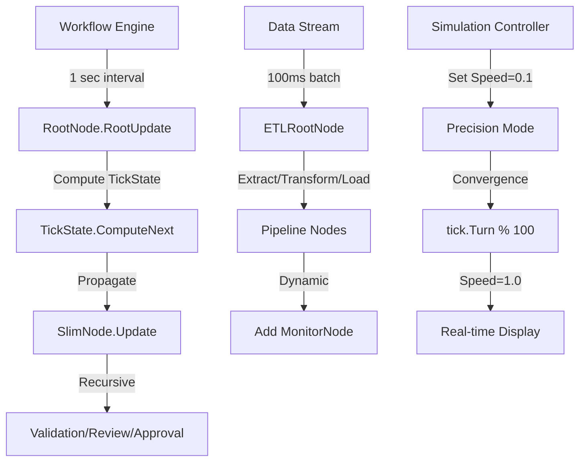
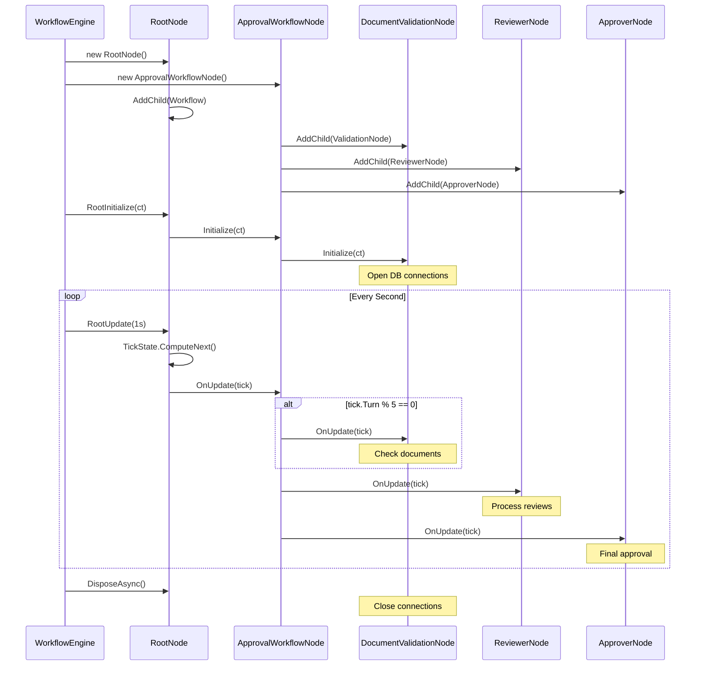

# NodeFlow Specification

## 1. Overview

### Problem Statement
Applications need a general-purpose hierarchical execution framework for coordinated processing of complex workflows. Existing solutions are often domain-specific, tightly coupled to particular frameworks, or lack proper lifecycle management for hierarchical task structures.

### Goals
- Provide minimal hierarchical execution framework with tick-based updates
- Support parent-child task relationships with proper lifecycle management
- Enable deterministic time-based execution for simulations and workflows
- Ensure proper resource management through async disposal patterns
- Remain pure .NET without framework dependencies
- Support diverse domains: business workflows, simulations, data pipelines

### E2E Scenarios

#### NODEFLOW_E2E_01_WorkflowOrchestration: Multi-Step Business Process
Organization implements document approval workflow:
1. Developer creates RootNode and adds ApprovalWorkflowNode as child
2. ApprovalWorkflowNode adds DocumentValidationNode, ReviewerNode, and ApproverNode children
3. System calls RootInitialize, establishing database connections and loading rules
4. Workflow engine calls RootUpdate(1 second) to process pending documents
5. TickState flows through tree, each node processes its batch of work
6. ValidationNode checks document completeness in tick.Turn % 5 == 0
7. ReviewerNode processes reviews when validation complete
8. ApproverNode finalizes approved documents, sends notifications
9. On shutdown, RootNode disposal closes connections gracefully

#### NODEFLOW_E2E_02_DataPipeline: ETL Processing System
Developer builds data transformation pipeline:
1. Developer creates ETLRootNode with ExtractNode, TransformNode, LoadNode children
2. Each node maintains internal buffer and processing state
3. System initializes pipeline, opening data source connections
4. Pipeline runs RootUpdate every 100ms for streaming processing
5. ExtractNode reads data batches based on tick.UpdateCount
6. TransformNode applies business rules using tick.Elapsed for timing
7. LoadNode writes to destination, batching by tick.Turn boundaries
8. Developer adds MonitorNode dynamically to track throughput
9. Removed nodes flush buffers via OnRemove before cleanup

#### NODEFLOW_E2E_03_SimulationFramework: Scientific Computation
Researcher implements finite element analysis:
1. Developer creates SimulationRootNode with MeshNode children
2. Each MeshNode represents region with computation requirements
3. Simulation initializes with model parameters and boundary conditions
4. Main loop calls RootUpdate(10ms) for time-stepped integration
5. TickState.Speed set to 0.1 for high-precision slow computation
6. MeshNodes exchange boundary data between update phases
7. Convergence check uses tick.Turn to trigger every 100 iterations
8. Speed returns to 1.0 for real-time visualization phase
9. Results saved periodically based on tick.Time thresholds

### User Stories

#### NODEFLOW_STORY_01_HierarchicalExecution: Developer creates execution tree
As a developer, I need to create hierarchical execution trees so my application can coordinate complex multi-step processes.

#### NODEFLOW_STORY_02_DeterministicTiming: Developer implements time-based logic
As a developer, I need deterministic tick-based execution so my workflows run consistently regardless of system load.

#### NODEFLOW_STORY_03_ResourceManagement: Developer manages lifecycle resources
As a developer, I need proper lifecycle callbacks so I can initialize connections and clean up resources properly.

### Education
- [Hierarchical Task Network Planning](https://en.wikipedia.org/wiki/Hierarchical_task_network)
- [Composite Pattern](https://refactoring.guru/design-patterns/composite)
- [Actor Model](https://en.wikipedia.org/wiki/Actor_model)
- [Workflow Patterns](http://www.workflowpatterns.com/)

## 2. Functional Specification

### E2E Scenario Mapping
- **NODEFLOW_E2E_01_WorkflowOrchestration**: Requires SlimNode hierarchy, lifecycle hooks, tick-based scheduling
- **NODEFLOW_E2E_02_DataPipeline**: Requires dynamic add/remove, state management, streaming updates
- **NODEFLOW_E2E_03_SimulationFramework**: Requires TickState.Speed control, deterministic execution

### Primary Resources
- [SlimNode.cs](SlimNode.cs) - Core node implementation with lifecycle
- [RootNode.cs](RootNode.cs) - Root coordinator with tick management
- [TickState.cs](TickState.cs) - Immutable execution state record

### Key Components

**SlimNode** ([SlimNode.cs](SlimNode.cs#L17))
- Supports: All E2E scenarios as base execution unit
- Parent/child relationship management
- Async initialization and update lifecycle
- Resource disposal through AsyncDisposeGuard
- Call counter validation ensures proper inheritance

**RootNode** ([RootNode.cs](RootNode.cs#L4))
- Supports: NODEFLOW_E2E_01 workflow coordination
- Manages global TickState for execution tree
- RootUpdate(TimeSpan) drives execution cycles
- RootInitialize(CancellationToken) bootstraps tree

**TickState** ([TickState.cs](TickState.cs#L9))
- Supports: NODEFLOW_E2E_03 simulation timing control
- Immutable record with elapsed/total time tracking
- Turn counter for discrete execution phases
- Speed multiplier for execution rate control
- Previous tick reference for delta computations

### Integration



### Architecture

```mermaid
classDiagram
    %% Core classes for E2E scenarios
    class SlimNode {
        +Parent: SlimNode
        +Children: ReadOnlySpan
        +IsInitialized: bool
        #_lifecycleCt: CancellationToken
        #OnInitialize() Task
        #OnUpdate(TickState) Task
        +AddChild(SlimNode) Task
        +RemoveChild(SlimNode) void
        #OnAdded() void
        #OnRemove() void
    }

    class RootNode {
        +CurrentTick: TickState
        +RootInitialize(CancellationToken) Task
        +RootUpdate(TimeSpan) Task
    }

    class TickState {
        +Speed: float
        +Elapsed: TimeSpan
        +Time: TimeSpan
        +Turn: int
        +UpdateCount: ulong
        +Previous: TickState
        +ComputeNext(TickState, TimeSpan) TickState
    }

    class AsyncDisposeGuard {
        +IsDisposed: bool
        +DisposeAsync() Task
        #OnDispose(bool) Task
    }

    RootNode --|> SlimNode : inherits
    SlimNode --|> AsyncDisposeGuard : inherits
    SlimNode --> TickState : uses
    RootNode --> TickState : manages

    %% Links
    click SlimNode "SlimNode.cs#L17"
    click RootNode "RootNode.cs#L4"
    click TickState "TickState.cs#L9"
```

### Dependencies
- **NODEFLOW_E2E_01**: AsyncDisposeGuard for resource cleanup
- **NODEFLOW_E2E_02**: MemoryOwnerCopy for safe iteration during modifications
- **NODEFLOW_E2E_03**: No external dependencies, pure computation

### API Surface
NodeFlow is a library component without HTTP endpoints. Public API methods:
- [SlimNode.AddChild](SlimNode.cs#L105) - Add child node to hierarchy
- [SlimNode.RemoveChild](SlimNode.cs#L139) - Remove child from tree
- [RootNode.RootInitialize](RootNode.cs#L23) - Bootstrap execution tree
- [RootNode.RootUpdate](RootNode.cs#L17) - Drive execution cycle
- [TickState.ComputeNext](TickState.cs#L37) - Calculate next execution state

### Education
- [Async/Await Best Practices](https://docs.microsoft.com/en-us/archive/msdn-magazine/2013/march/async-await-best-practices-in-asynchronous-programming)
- [Task Parallel Library](https://docs.microsoft.com/en-us/dotnet/standard/parallel-programming/task-parallel-library-tpl)
- [Dataflow (Task Parallel Library)](https://docs.microsoft.com/en-us/dotnet/standard/parallel-programming/dataflow-task-parallel-library)

## 3. Technical Specification

### E2E Scenario Implementation

#### NODEFLOW_E2E_01_WorkflowOrchestration Technical Flow


### DDD Architecture for E2E Scenarios

#### NODEFLOW_E2E_01_WorkflowOrchestration
- **Domain**: WorkflowNode (entity), DocumentState (value object)
- **AppLogic**: ApprovalWorkflowNode orchestrates approval steps
- **Infrastructure**: Database connections managed via Initialize/Dispose

#### NODEFLOW_E2E_02_DataPipeline
- **Domain**: PipelineNode hierarchy represents ETL stages
- **AppLogic**: ExtractNode/TransformNode/LoadNode encapsulate ETL logic
- **Events**: OnAdded/OnRemove manage pipeline reconfiguration

#### NODEFLOW_E2E_03_SimulationFramework
- **Domain**: MeshNode entities with computation state
- **AppLogic**: SimulationRootNode controls execution speed
- **Calculation**: TickState.Speed modulates computation rate

### Public AppLogic API

Methods supporting E2E scenarios:

```csharp
// NODEFLOW_E2E_01: Initialize and execute workflow tree
public ValueTask RootInitialize(CancellationToken ct);  // Setup connections
public ValueTask RootUpdate(TimeSpan wallTimeDelta);    // Process workflow step

// NODEFLOW_E2E_02: Manage pipeline stages dynamically
public virtual ValueTask AddChild(SlimNode child);      // Add pipeline stage
public virtual void RemoveChild(SlimNode child);        // Remove stage with flush

// NODEFLOW_E2E_03: Control simulation execution rate
public static TickState ComputeNext(TickState? previous, TimeSpan timeDelta);
// Modify TickState.Speed before ComputeNext for rate control
```

### Real-World Examples and Scenarios

#### NODEFLOW_E2E_01_WorkflowOrchestration: Document Approval Implementation
```csharp
public class ApprovalWorkflowNode : SlimNode
{
    private IDocumentRepository _repository;

    protected override async ValueTask OnInitialize()
    {
        _repository = new DocumentRepository(_lifecycleCt);
        await _repository.Connect();
        await base.OnInitialize(); // Initialize child nodes
    }

    protected override async ValueTask OnUpdate(TickState tick)
    {
        // Check for new documents every 5 ticks
        if (tick.Turn % 5 == 0)
        {
            var pending = await _repository.GetPendingDocuments();
            // Process documents through children
        }

        await base.OnUpdate(tick); // Update validation/review/approval nodes
    }

    protected override async ValueTask OnDispose(bool disposing)
    {
        if (disposing)
        {
            await _repository.Disconnect();
        }
        await base.OnDispose(disposing);
    }
}

// Usage
var root = new RootNode();
var workflow = new ApprovalWorkflowNode();
await root.AddChild(workflow);

await workflow.AddChild(new DocumentValidationNode());
await workflow.AddChild(new ReviewerNode());
await workflow.AddChild(new ApproverNode());

var cts = new CancellationTokenSource();
await root.RootInitialize(cts.Token);

// Run workflow engine
var timer = new PeriodicTimer(TimeSpan.FromSeconds(1));
while (await timer.WaitForNextTickAsync(cts.Token))
{
    await root.RootUpdate(TimeSpan.FromSeconds(1));
}
```

**Error Handling**:
- Database connection failure: Exception in OnInitialize
- Document processing error: Logged, continues next tick
- Disposal during processing: CancellationToken stops execution

#### NODEFLOW_E2E_02_DataPipeline: Streaming ETL Pipeline
```csharp
public class ExtractNode : SlimNode
{
    private Queue<DataBatch> _buffer = new();

    protected override async ValueTask OnUpdate(TickState tick)
    {
        // Extract data every update
        var batch = await ExtractDataBatch(tick.UpdateCount);
        _buffer.Enqueue(batch);

        await base.OnUpdate(tick); // Let transform nodes process
    }

    protected override void OnRemove()
    {
        base.OnRemove();
        // Flush remaining buffer
        foreach (var batch in _buffer)
        {
            batch.Dispose();
        }
    }
}

// Dynamic pipeline modification
var pipeline = new ETLRootNode();
var extractNode = new ExtractNode();
await pipeline.AddChild(extractNode);
await pipeline.AddChild(new TransformNode());
await pipeline.AddChild(new LoadNode());

// Add monitoring at runtime
if (needsMonitoring)
{
    var monitor = new MonitorNode();
    await pipeline.AddChild(monitor); // Automatically initialized
}

// Remove node with proper cleanup
pipeline.RemoveChild(extractNode); // Triggers OnRemove, flushes buffer
```

#### NODEFLOW_E2E_03_SimulationFramework: FEA Simulation Control
```csharp
public class SimulationRootNode : RootNode
{
    private float _targetSpeed = 1.0f;

    public void SetPrecisionMode(bool enabled)
    {
        _targetSpeed = enabled ? 0.1f : 1.0f;
    }

    public override async ValueTask RootUpdate(TimeSpan wallTimeDelta)
    {
        // Apply speed modification
        var previousTick = CurrentTick ?? TickState.Default;
        var modifiedTick = previousTick with { Speed = _targetSpeed };
        CurrentTick = TickState.ComputeNext(modifiedTick, wallTimeDelta);

        await Update(CurrentTick);

        // Convergence check every 100 iterations
        if (CurrentTick.Turn % 100 == 0)
        {
            CheckConvergence();
        }
    }
}

// Usage
var simulation = new SimulationRootNode();
foreach (var meshRegion in meshRegions)
{
    await simulation.AddChild(new MeshNode(meshRegion));
}

await simulation.RootInitialize(CancellationToken.None);

// High precision computation
simulation.SetPrecisionMode(true);
for (int i = 0; i < 1000; i++)
{
    await simulation.RootUpdate(TimeSpan.FromMilliseconds(10));
}

// Real-time visualization
simulation.SetPrecisionMode(false);
await simulation.RootUpdate(TimeSpan.FromMilliseconds(16.67));
```

### Usage

Implementing each E2E scenario:

1. **NODEFLOW_E2E_01**: See document approval workflow example above
2. **NODEFLOW_E2E_02**: See streaming ETL pipeline example above
3. **NODEFLOW_E2E_03**: See FEA simulation control example above

### Testing

Currently no dedicated test suite. When implemented, tests should validate:

- **NODEFLOW_E2E_01**: Workflow state transitions, resource lifecycle, error recovery
- **NODEFLOW_E2E_02**: Dynamic reconfiguration, buffer management, streaming continuity
- **NODEFLOW_E2E_03**: Time dilation accuracy, convergence detection, deterministic execution

Test implementation pattern:
```csharp
[Fact]
public async Task NODEFLOW_E2E_01_WorkflowOrchestration()
{
    // Test complete workflow scenario
    var root = new RootNode();
    var workflow = new ApprovalWorkflowNode();
    await root.AddChild(workflow);
    await root.RootInitialize(CancellationToken.None);

    // Simulate document processing
    await root.RootUpdate(TimeSpan.FromSeconds(1));

    Assert.Equal(1, workflow.ProcessedDocuments);
    Assert.Equal(1, root.CurrentTick.Turn);

    await root.DisposeAsync();
    Assert.True(workflow.IsDisposed);
}
```