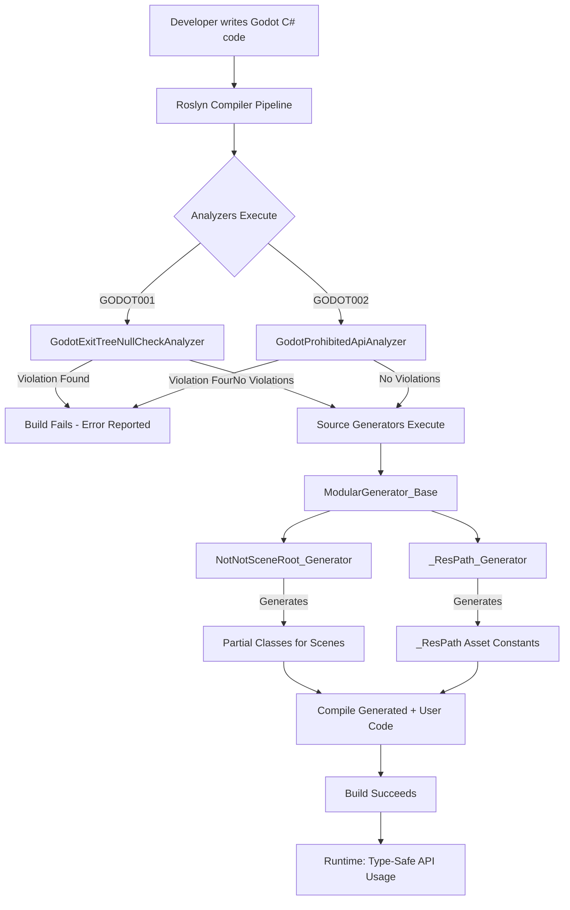
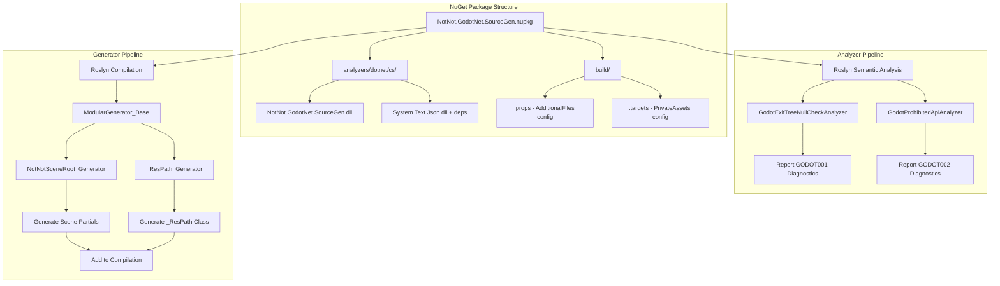
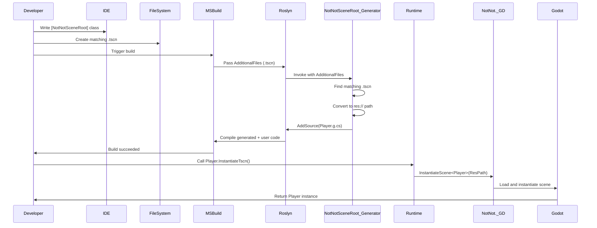
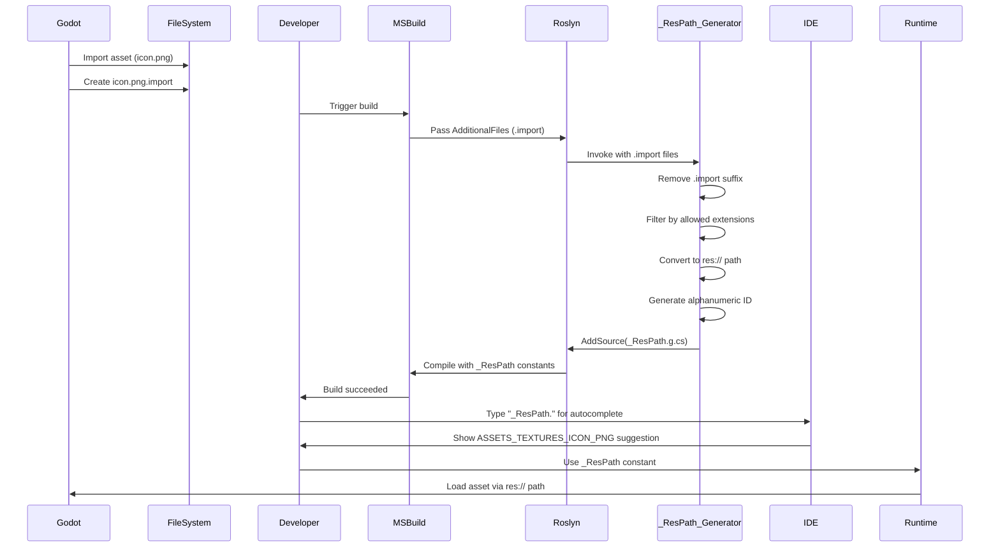

# NotNot.GodotNet.SourceGen - Product Requirements Document

**LastCommitHash**: d7f4c662e7ee72edbb72bd4e2fe8c2a0f12b7568
**YYYYMMDD-HHmm**: 20251108-1035

## 1. Purpose & Business Value

### Why We Built This

Godot C# development lacks compile-time safety for common runtime pitfalls and requires boilerplate code for type-safe scene instantiation and asset loading. This library provides Roslyn analyzers and source generators to eliminate runtime errors at compile-time and auto-generate type-safe APIs for Godot resources.

### E2E User Scenarios

#### GODOT_SOURCEGEN_E2E_01_NullCheck: Prevent _ExitTree NullReferenceExceptions

**Context**: During Godot editor cold-reload, `_ExitTree()` may be called on objects with only default constructors invoked, causing member fields to be null and throw NullReferenceException when accessed.

**User Journey**:
1. Developer creates `MyGodotNode.cs` inheriting from `Godot.Node`
2. Developer adds member field `private Timer _cooldownTimer;`
3. Developer overrides `_ExitTree()` and writes `_cooldownTimer.Stop();`
4. Developer triggers build
5. **Analyzer GODOT001 detects unsafe member access**
6. Build fails with error: "Member variable '_cooldownTimer' in _ExitTree() must use null-conditional operator or null check"
7. Developer applies code fix or manually changes to `_cooldownTimer?.Stop();`
8. Build succeeds

**Validation**: Build errors appear in IDE error list. Build process exits with non-zero code until fixed.

---

#### GODOT_SOURCEGEN_E2E_02_ProhibitedApi: Prevent MultiMesh.CustomAabb Positioning Bug

**Context**: Godot's `MultiMesh.CustomAabb` property has a positioning bug where the AABB corner (not center) is positioned at the node center, causing incorrect culling calculations.

**User Journey**:
1. Developer writes code: `multiMesh.CustomAabb = new Aabb(Vector3.Zero, new Vector3(10, 10, 10));`
2. Developer triggers build
3. **Analyzer GODOT002 detects prohibited API usage**
4. Build fails with error: "API 'Godot.MultiMesh.CustomAabb' is prohibited: CustomAabb has a positioning bug where AABB corner (not center) is positioned at node center, causing incorrect culling. Use MultiMesh.GenerateAabb() for automatic calculation..."
5. Developer changes to `multiMesh.GenerateAabb();`
6. Build succeeds
7. Runtime culling works correctly

**Validation**: Build errors appear in IDE error list. Developer can disable via .editorconfig if absolutely necessary.

---

#### GODOT_SOURCEGEN_E2E_03_SceneInstantiation: Type-Safe Scene Loading

**Context**: Default Godot C# pattern uses string-based scene loading: `GD.Load<PackedScene>("res://scenes/Player.tscn").Instantiate<Player>()`, which is error-prone (typos, path changes, type mismatches).

**User Journey**:
1. Developer creates `Player.cs` class inheriting from `Node`
2. Developer adds `[NotNotSceneRoot]` attribute to class
3. Developer creates `Player.tscn` scene file in same directory
4. Developer adds to .csproj: `<AdditionalFiles Include="**/*.tscn" />`
5. Developer triggers build
6. **Source generator NotNotSceneRoot_Generator executes**
7. Generator discovers `Player.tscn` matching `Player.cs`
8. Generator creates partial class:
   ```csharp
   public partial class Player
   {
       public static readonly string ResPath = "res://Player.tscn";
       public static Player InstantiateTscn() =>
           _GD.InstantiateScene<Player>(ResPath);
   }
   ```
9. Developer writes: `var player = Player.InstantiateTscn();`
10. Build succeeds with compile-time type safety
11. Runtime instantiation succeeds

**E2E Test**: [Tests/SceneGeneratorTests.cs#L42](../../tests/NotNot.GodotNet.SourceGen.Tests/SceneGeneratorTests.cs) - validates generated code structure and ResPath accuracy

---

#### GODOT_SOURCEGEN_E2E_04_ResPathAccess: Compile-Time Asset References

**Context**: Default Godot C# pattern uses string literals for asset loading: `ResourceLoader.Load("res://assets/textures/icon.png")`, which breaks when assets are moved/renamed.

**User Journey**:
1. Developer adds texture asset: `assets/textures/icon.png`
2. Godot imports asset, creating `icon.png.import` file
3. Developer adds to .csproj: `<AdditionalFiles Include="**/*.import" />`
4. Developer triggers build
5. **Source generator _ResPath_Generator executes**
6. Generator scans all `.import` files
7. Generator converts `assets/textures/icon.png` to `_ResPath.ASSETS_TEXTURES_ICON_PNG`
8. Generator creates class:
   ```csharp
   public partial class _ResPath
   {
       public static StringName ASSETS_TEXTURES_ICON_PNG = "res://assets/textures/icon.png";
   }
   ```
9. Developer writes: `var texture = ResourceLoader.Load<Texture2D>(_ResPath.ASSETS_TEXTURES_ICON_PNG);`
10. Build succeeds with IntelliSense autocomplete for asset paths
11. Runtime loading succeeds
12. If asset is moved, constant name updates automatically on next build

**E2E Test**: [Tests/ResPathGeneratorTests.cs#L58](../../tests/NotNot.GodotNet.SourceGen.Tests/ResPathGeneratorTests.cs) - validates generated constants match imported assets

---

### User Stories

**GODOT_SOURCEGEN_US_01_AutoFix**: As a developer, when GODOT001 reports a null-safety error in `_ExitTree()`, I want a one-click code fix that adds the null-conditional operator, so I can quickly resolve the issue without manually editing code.

**GODOT_SOURCEGEN_US_02_SceneRefactor**: As a developer, when I rename or move a .tscn file, I want the generated `ResPath` constant to automatically update on next build, so I don't have to manually update string literals throughout my codebase.

**GODOT_SOURCEGEN_US_03_MultiProject**: As a developer working on a solution with multiple Godot projects, I want each project to have its own `_ResPath` class scoped to its namespace, so asset references don't collide across projects.

---

### Education

- [Roslyn Source Generators Overview](https://learn.microsoft.com/en-us/dotnet/csharp/roslyn-sdk/source-generators-overview)
- [Incremental Generators](https://github.com/dotnet/roslyn/blob/main/docs/features/incremental-generators.md)
- [Diagnostic Analyzers](https://learn.microsoft.com/en-us/visualstudio/code-quality/roslyn-analyzers-overview)
- [Godot C# Scripting](https://docs.godotengine.org/en/stable/tutorials/scripting/c_sharp/index.html)
- [Creating NuGet Packages](https://learn.microsoft.com/en-us/nuget/create-packages/creating-a-package)

---

## 2. Functional Specification - External Perspective

### E2E Scenario Mapping

**E2E_01 NullCheck** → `GodotExitTreeNullCheckAnalyzer`, `GodotExitTreeNullCheckCodeFixProvider`
**E2E_02 ProhibitedApi** → `GodotProhibitedApiAnalyzer`
**E2E_03 SceneInstantiation** → `NotNotSceneRoot_Generator`, `ModularGenerator_Base`
**E2E_04 ResPathAccess** → `_ResPath_Generator`, `ModularGenerator_Base`

---

### Primary Resources

- [ReadMe.md](ReadMe.md) - User-facing documentation with analyzer explanations and usage examples
- [Roslyn SDK Documentation](https://learn.microsoft.com/en-us/dotnet/csharp/roslyn-sdk/)
- [Godot C# API Reference](https://docs.godotengine.org/en/stable/classes/index.html)

---

### Key Components

#### Analyzers

**[GodotExitTreeNullCheckAnalyzer.cs](Analyzers/GodotExitTreeNullCheckAnalyzer.cs)** (E2E_01):
- Diagnostic ID: GODOT001
- Severity: Error
- Scans `_ExitTree()` overrides in Godot.Node-derived classes
- Detects reference type field accesses without null protection
- Supports null-conditional operators (`?.`), explicit null checks, and if-statement protection

**[GodotExitTreeNullCheckCodeFixProvider.cs](Analyzers/GodotExitTreeNullCheckCodeFixProvider.cs)** (E2E_01):
- Provides one-click code fix for GODOT001
- Converts `field.Method()` to `field?.Method()`
- Registered with Roslyn code fix infrastructure

**[GodotProhibitedApiAnalyzer.cs](Analyzers/GodotProhibitedApiAnalyzer.cs)** (E2E_02):
- Diagnostic ID: GODOT002
- Severity: Error
- Dictionary-based banned API registry
- Currently bans: `Godot.MultiMesh.CustomAabb`, `Godot.MultiMeshInstance3D.CustomAabb`
- Extensible for future Godot API prohibitions

#### Source Generators

**[ModularGenerator_Base.cs](Generators/Modular/ModularGenerator_Base.cs)** (E2E_03, E2E_04):
- Abstract base class for all incremental generators
- Implements `IIncrementalGenerator`
- Provides shared infrastructure:
  - Syntax provider for attributed classes
  - AdditionalFiles provider with regex filtering
  - Root namespace discovery
  - Combined provider pipeline
- Child generators implement `GeneratePartialClasses(GodotResourceGeneratorContextConfig)`

**[NotNotSceneRoot_Generator.cs](Generators/Modular/NotNotSceneRoot_Generator.cs)** (E2E_03):
- Finds classes with `[NotNotSceneRoot]` attribute
- Matches class name to .tscn file in AdditionalFiles
- Generates partial class with `ResPath` property and `InstantiateTscn()` method
- Generates `NotNotSceneLoader` static class with scene path dictionary
- Throws descriptive error if no matching .tscn found or duplicate scene names exist

**[_ResPath_Generator.cs](Generators/Modular/_ResPath_Generator.cs)** (E2E_04):
- Scans `.import` and `.uid` files in AdditionalFiles
- Filters by allowed extensions (.gd, .tres, .txt, .json, .res, .model, .gdshader)
- Converts OS file paths to `res://` format
- Generates alphanumeric-caps identifiers from file paths
- Creates `_ResPath` partial class with `StringName` constants

#### Configuration & Helpers

**[GodotResourceGeneratorContextConfig.cs](GodotResourceGeneratorContextConfig.cs)** (E2E_03, E2E_04):
- Shared context object passed to all generators
- Discovers project root via `project.godot` location
- Provides `TryConvertFilePathToResPath()` helper
- Exposes `SourceProductionContext`, `RootNamespace`, `AdditionalFiles`, `Classes`

**[Helpers/zz_Extensions.cs](Helpers/zz_Extensions.cs)**:
- Extension methods for code generation
- `_GetNamespaceName()` extracts namespace from ClassDeclarationSyntax
- `_ConvertToAlphanumericCaps()` sanitizes file paths for identifier names
- `_Error()` helper for reporting diagnostics

---

### Integration



**MSBuild Integration Flow**:
1. NuGet package installed in consuming project
2. `.targets` file marks package as `PrivateAssets=All`
3. `.props` file adds `<AdditionalFiles>` for .tscn, .gd, .import, project.godot
4. MSBuild passes AdditionalFiles to Roslyn compiler
5. Compiler invokes analyzers and generators with AdditionalFiles context
6. Generated source files added to compilation

---

### Architecture



---

### Dependencies

**Microsoft.CodeAnalysis.CSharp** (4.14.0) - Required for E2E_01, E2E_02, E2E_03, E2E_04:
Provides Roslyn SDK for syntax tree analysis, semantic model access, and source generation APIs.

**System.Text.Json** (9.0.8) - Required for E2E_03, E2E_04:
Used to parse Godot `.import` files and `project.godot` configuration. Complex scaffolding required for netstandard2.0 compatibility (all transitive dependencies must be packaged in analyzers folder).

**NotNot Framework** - Required for E2E_03, E2E_04:
Generated code depends on `_GD.InstantiateScene<T>()` helper and other NotNot utilities. Not a direct dependency of this library but required in consuming projects.

**Godot 4.x** - Required for E2E_01, E2E_02, E2E_03:
Target platform. Analyzers scan for Godot.Node-derived classes and Godot API usage.

---

### API Surface

**No public API endpoints** - This is a build-time tooling library, not a runtime library. All functionality is exposed through:
- Roslyn analyzers (GODOT001, GODOT002)
- Source-generated code (partial classes, _ResPath)
- MSBuild integration (.props, .targets files)

---

## 3. Technical Specification - Internals

### E2E Scenario Implementation

#### E2E_01: NullCheck Implementation

**Domain**: Roslyn DiagnosticAnalyzer
**AppLogic**: `GodotExitTreeNullCheckAnalyzer.AnalyzeMethod()`
**Flow**:
1. Roslyn invokes analyzer during semantic analysis phase
2. `Initialize()` registers `AnalyzeMethod` for `SyntaxKind.MethodDeclaration` nodes
3. `AnalyzeMethod()` filters for `_ExitTree` override in Godot.Node-derived classes
4. Walks method body syntax tree for member access expressions
5. For each reference type field access, checks `IsProtectedExpression()`
6. If not protected (no `?.`, no null check), calls `ReportDiagnostic()`
7. Roslyn displays diagnostic in IDE and fails build

**Code Fix Flow**:
1. User triggers "Show potential fixes" in IDE
2. Roslyn invokes `GodotExitTreeNullCheckCodeFixProvider.RegisterCodeFixesAsync()`
3. Provider registers `ApplyCodeFix` action
4. User selects fix
5. `ApplyCodeFix` creates new document with `?.` operator inserted
6. IDE applies document change

#### E2E_02: ProhibitedApi Implementation

**Domain**: Roslyn DiagnosticAnalyzer
**AppLogic**: `GodotProhibitedApiAnalyzer.AnalyzeMemberAccess()`
**Flow**:
1. Roslyn invokes analyzer during semantic analysis phase
2. `Initialize()` registers `AnalyzeMemberAccess` for `SyntaxKind.SimpleMemberAccessExpression`
3. `AnalyzeMemberAccess()` gets symbol info for member access
4. Checks if symbol is `IPropertySymbol`
5. Builds full API name: `property.ToDisplayString()`
6. Looks up in `BannedApis` dictionary
7. If match found, calls `ReportDiagnostic()` with prohibition reason
8. Roslyn displays diagnostic in IDE and fails build

#### E2E_03: SceneInstantiation Implementation

**Domain**: Roslyn IIncrementalGenerator
**AppLogic**: `NotNotSceneRoot_Generator.GeneratePartialClasses()`
**Flow**:
1. Roslyn invokes generator during compilation
2. `ModularGenerator_Base.Initialize()` sets up incremental pipeline:
   - SyntaxProvider finds classes with attributes
   - AdditionalTextsProvider filters .tscn files via regex
   - AnalyzerConfigOptionsProvider gets root namespace
   - `Combine()` merges all providers
3. `RegisterSourceOutput()` invokes `ExecuteGenerator()` with combined data
4. `NotNotSceneRoot_Generator.GeneratePartialClasses()` iterates classes:
   - Extract class name and namespace
   - Search AdditionalFiles for matching `{ClassName}.tscn`
   - Convert file path to res:// format via `config.TryConvertFilePathToResPath()`
   - Generate partial class source text with `ResPath` and `InstantiateTscn()` members
   - Call `context.AddSource()` to add to compilation
5. Generate `NotNotSceneLoader` static class with scene dictionary
6. Roslyn compiles generated code with user code

**Generated Code Example**:
```csharp
// For class Player with Player.tscn
namespace MyGame;

public partial class Player
{
    public static readonly string ResPath = "res://Player.tscn";

    public static Player InstantiateTscn()
    {
        return _GD.InstantiateScene<Player>(ResPath);
    }
}
```

#### E2E_04: ResPathAccess Implementation

**Domain**: Roslyn IIncrementalGenerator
**AppLogic**: `_ResPath_Generator.GeneratePartialClasses()`
**Flow**:
1. Roslyn invokes generator during compilation
2. `ModularGenerator_Base.Initialize()` sets up pipeline filtering `.import` and `.uid` files
3. `_ResPath_Generator.GeneratePartialClasses()` invoked with AdditionalFiles
4. `Gen_ImportedAssetsClass()` processes each file:
   - Remove `.import` or `.uid` suffix to get original asset filename
   - Filter by allowed extensions (whitelist: .gd, .tres, .txt, .json, .res, .model, .gdshader)
   - Convert file path to res:// format
   - Generate identifier: `file.Path.Replace(resRootPath, "")._ConvertToAlphanumericCaps()`
   - Append to StringBuilder: `public static StringName {id} = "{resPath}";`
5. Wrap in `_ResPath` partial class with namespace from root namespace provider
6. Call `context.AddSource("_ResPath.g.cs", sourceText)`
7. Roslyn compiles generated code

**Generated Code Example**:
```csharp
namespace MyGame;

public partial class _ResPath
{
    public static StringName ASSETS_TEXTURES_ICON_PNG = "res://assets/textures/icon.png";
    public static StringName SCENES_PLAYER_TSCN = "res://scenes/Player.tscn";
    public static StringName SCRIPTS_ENEMY_GD = "res://scripts/Enemy.gd";
}
```

---

### Public AppLogic API

**No public AppLogic APIs** - This library operates entirely within Roslyn compiler pipeline:
- Analyzers implement `DiagnosticAnalyzer.Initialize(AnalysisContext)`
- Generators implement `IIncrementalGenerator.Initialize(IncrementalGeneratorInitializationContext)`
- Generated code creates public APIs in consuming projects

---

### Real-World Examples and Scenarios

#### GODOT001 Analyzer - Null Safety in _ExitTree

**Scenario**: Developer writes disposal logic in `_ExitTree()` without null checks

**Code Before**:
```csharp
public partial class GameManager : Node
{
    private Timer _updateTimer;
    private AudioStreamPlayer _bgMusic;

    public override void _ExitTree()
    {
        _updateTimer.Stop();           // ❌ GODOT001 error
        _bgMusic.Stop();                // ❌ GODOT001 error
    }
}
```

**Diagnostic**:
```
Error GODOT001: Member variable '_updateTimer' in _ExitTree() must use null-conditional operator or null check
Error GODOT001: Member variable '_bgMusic' in _ExitTree() must use null-conditional operator or null check
```

**Code After Fix**:
```csharp
public override void _ExitTree()
{
    _updateTimer?.Stop();              // ✅ Null-safe
    _bgMusic?.Stop();                  // ✅ Null-safe
}
```

**Alternative Pattern (Explicit Check)**:
```csharp
public override void _ExitTree()
{
    if (_updateTimer != null)
    {
        _updateTimer.Stop();           // ✅ Protected by if
    }
}
```

**Error Handling**: None needed - analyzer prevents compilation until fixed.

---

#### GODOT002 Analyzer - Prohibited MultiMesh.CustomAabb

**Scenario**: Developer attempts to use CustomAabb for manual culling bounds

**Code Before**:
```csharp
var multiMesh = new MultiMesh();
multiMesh.CustomAabb = new Aabb(Vector3.Zero, new Vector3(50, 50, 50));  // ❌ GODOT002 error
```

**Diagnostic**:
```
Error GODOT002: API 'Godot.MultiMesh.CustomAabb' is prohibited: CustomAabb has a positioning bug where AABB corner (not center) is positioned at node center, causing incorrect culling. Use MultiMesh.GenerateAabb() for automatic calculation, or manually adjust for corner offset if CustomAabb is required.
```

**Code After Fix (Recommended)**:
```csharp
var multiMesh = new MultiMesh();
// ... populate mesh instances ...
multiMesh.GenerateAabb();             // ✅ Automatic AABB from mesh data
```

**Alternative (Manual Adjustment)**:
```csharp
// If AABB must be set manually, compute corner position
var aabbSize = new Vector3(50, 50, 50);
var centerPos = Vector3.Zero;
// Note: Still avoid CustomAabb; use mesh bounds instead or accept the corner offset
```

**Disabling (If Absolutely Necessary)**:
```ini
# .editorconfig
[*.cs]
dotnet_diagnostic.GODOT002.severity = none
```

---

#### NotNotSceneRoot_Generator - Type-Safe Scene Loading

**Scenario**: Developer wants to instantiate Player scene without string literals

**Setup**:
1. Create `Player.cs`:
```csharp
using Godot;

[NotNotSceneRoot]
public partial class Player : CharacterBody3D
{
    // User-defined members
    public float Speed { get; set; } = 5.0f;
}
```

2. Create `Player.tscn` scene in same directory

3. Add to .csproj:
```xml
<ItemGroup>
  <AdditionalFiles Include="**/*.tscn" />
</ItemGroup>
```

4. Build project

**Generated Code** (`Player.g.cs`):
```csharp
using Godot;
using NotNot;

namespace MyGame;

public partial class Player
{
    public static readonly string ResPath = "res://Player.tscn";

    public static Player InstantiateTscn()
    {
        return _GD.InstantiateScene<Player>(ResPath);
    }
}
```

**Usage in Game Code**:
```csharp
// Old pattern - error-prone
var player = GD.Load<PackedScene>("res://Player.tscn").Instantiate<Player>();

// New pattern - type-safe, refactor-safe
var player = Player.InstantiateTscn();
AddChild(player);
player.Speed = 10.0f;
```

**Integration Flow**:


**Permission/Authorization**: None - build-time tool.

**Error Handling**:
- If no matching .tscn found: Generator reports error "No ResPath found for {ClassName}. Should not be marked with [NotNotSceneRoot]..."
- If duplicate scene names exist: `NotNotSceneLoader.InstantiateTscn<T>()` throws `InvalidOperationException` at runtime with message "The type {className} could not be instantiated from the scene at {tscnResPath}. Are there two scenes with the same name?"

---

#### _ResPath_Generator - Compile-Time Asset Constants

**Scenario**: Developer wants IntelliSense autocomplete for asset paths

**Setup**:
1. Import assets into Godot project:
   - `assets/textures/icon.png`
   - `assets/sounds/jump.wav`
   - `scripts/Enemy.gd`

2. Add to .csproj:
```xml
<ItemGroup>
  <AdditionalFiles Include="**/*.import" />
</ItemGroup>
```

3. Build project

**Generated Code** (`_ResPath.g.cs`):
```csharp
using Godot;
using NotNot;

namespace MyGame;

/// <summary>
/// Listing of all assets imported by Godot. This class is autogenerated by NotNot.GodotNet.SourceGen._ResPath_Generator
/// If you expect a file to be listed here that is not, be sure that it's in your `.csproj`
/// </summary>
public partial class _ResPath
{
    public static StringName ASSETS_TEXTURES_ICON_PNG = "res://assets/textures/icon.png";
    public static StringName ASSETS_SOUNDS_JUMP_WAV = "res://assets/sounds/jump.wav";
    public static StringName SCRIPTS_ENEMY_GD = "res://scripts/Enemy.gd";
}
```

**Usage in Game Code**:
```csharp
// Old pattern - typo-prone, breaks on refactor
var icon = ResourceLoader.Load<Texture2D>("res://assets/textures/icon.png");
var sound = ResourceLoader.Load<AudioStream>("res://assets/sounds/jump.wav");

// New pattern - IntelliSense autocomplete, compile-time validated
var icon = ResourceLoader.Load<Texture2D>(_ResPath.ASSETS_TEXTURES_ICON_PNG);
var sound = ResourceLoader.Load<AudioStream>(_ResPath.ASSETS_SOUNDS_JUMP_WAV);
```

**Integration Flow**:


**Error Handling**: If asset not listed in `_ResPath`, developer should verify:
1. Asset has been imported by Godot (`.import` file exists)
2. `.import` file extension is whitelisted in generator (not .glsl)
3. AdditionalFiles configured in .csproj

---

### Testing

**E2E Tests**: [To Be Implemented]
Required test scenarios:
- `GODOT_SOURCEGEN_E2E_01_NullCheck_Test`: Create test project with `_ExitTree()` unsafe access → Verify GODOT001 reported → Apply fix → Verify build succeeds
- `GODOT_SOURCEGEN_E2E_02_ProhibitedApi_Test`: Create test project using `MultiMesh.CustomAabb` → Verify GODOT002 reported → Replace with `GenerateAabb()` → Verify build succeeds
- `GODOT_SOURCEGEN_E2E_03_SceneInstantiation_Test`: Create `[NotNotSceneRoot]` class with matching .tscn → Build → Verify `ResPath` and `InstantiateTscn()` generated → Call `InstantiateTscn()` → Verify scene loaded
- `GODOT_SOURCEGEN_E2E_04_ResPathAccess_Test`: Import assets → Build → Verify `_ResPath` constants generated → Use constant with `ResourceLoader.Load()` → Verify asset loaded

**Integration Tests**: [To Be Implemented]
Test analyzer/generator combinations:
- GODOT001 with code fix provider roundtrip
- NotNotSceneRoot_Generator with missing .tscn file
- _ResPath_Generator with various file extensions
- Multi-project solution with namespace scoping

**Negative Tests**: [To Be Implemented]
- GODOT001: Field access inside if-statement null check should NOT report diagnostic
- GODOT002: .editorconfig severity override should suppress diagnostic
- NotNotSceneRoot_Generator: Duplicate scene names throw runtime exception
- _ResPath_Generator: .glsl files excluded from generation

---

## 4. Implementation Living Document

### Getting Started

**Prerequisites**:
- .NET SDK 8.0+
- Visual Studio 2022 or Rider with Roslyn SDK support
- Godot 4.x

**Development Setup**:
1. Clone repository
2. Open `NotNot.GodotNet.SourceGen.csproj`
3. Restore NuGet packages
4. Build solution

**Debugging Source Generators**:
1. Edit `ModularGenerator_Base.cs` line 68: Uncomment `Debugger.Launch();`
2. Rebuild generator project
3. Create test project referencing generator
4. Clean test project
5. Rebuild test project - debugger will attach on generator initialization

**Testing Changes**:
1. Edit analyzer or generator code
2. Rebuild generator project
3. Clean consuming project (CRITICAL - generators cached by IDE)
4. Rebuild consuming project
5. Verify changes in generated files (Solution Explorer → Dependencies → Analyzers → Source Generators)

---

### Contributing

**Coding Standards**:
- Follow [Roslyn Analyzer Guidelines](https://github.com/dotnet/roslyn-analyzers/blob/main/GuidelinesForNewRules.md)
- Use `LocalizableString` for all user-facing diagnostic messages
- Set `EnforceExtendedAnalyzerRules=true` for generator determinism
- Use incremental generators (IIncrementalGenerator) not legacy ISourceGenerator
- Cache expensive computations in incremental pipeline stages
- Avoid `Compilation.GetSemanticModel()` in generators (use SyntaxProvider Transform instead)

**Adding New Analyzers**:
1. Create analyzer class inheriting `DiagnosticAnalyzer`
2. Define `DiagnosticDescriptor` with unique ID (GODOT00X)
3. Implement `Initialize(AnalysisContext)`
4. Register appropriate syntax node action
5. Add documentation to [ReadMe.md](ReadMe.md)
6. Create unit tests
7. Optional: Implement `CodeFixProvider` for auto-fixes

**Adding New Generators**:
1. Create generator class inheriting `ModularGenerator_Base`
2. Set `TargetAttributes` and/or `TargetAdditionalFiles` regex patterns in constructor
3. Override `GeneratePartialClasses(GodotResourceGeneratorContextConfig config)`
4. Use `config.Context.AddSource(fileName, SourceText.From(code, Encoding.UTF8))`
5. Add documentation to [ReadMe.md](ReadMe.md)
6. Create integration tests

**Review Process**:
- All analyzer changes require severity justification (Error vs Warning)
- All generators must be deterministic (no DateTime.Now, random GUIDs, etc.)
- Performance impact evaluated for large projects (1000+ files)
- NuGet package tested in isolated project before release

---

### Work To Do

**High Priority**:
- [ ] Add E2E tests for all four scenarios (GODOT_SOURCEGEN_E2E_01 through E2E_04)
- [ ] Implement integration tests for analyzer/generator interactions
- [ ] Add negative test coverage for edge cases
- [ ] Document performance characteristics (build time impact for large projects)

**Medium Priority**:
- [ ] Extend GODOT002 banned API list based on community feedback
- [ ] Improve GODOT001 to detect property accesses (currently only fields)
- [ ] Add configurable severity levels via .editorconfig for all diagnostics
- [ ] Support path hints for duplicate scene names in NotNotSceneRoot_Generator

**Low Priority**:
- [ ] Generate XML documentation for _ResPath constants (include asset file metadata)
- [ ] Add telemetry for most common GODOT001/GODOT002 violations
- [ ] Create Visual Studio extension for enhanced generator debugging
- [ ] Support hot-reload of generated code in Godot editor

**Known Limitations**:
- GODOT001 does not detect property accesses (only fields) due to initialization semantics differences
- NotNotSceneRoot_Generator requires unique scene names across entire project
- _ResPath_Generator identifier naming can collide for similar file paths (e.g., `foo/bar.png` and `foo_bar.png` both generate `FOO_BAR_PNG`)
- Source generator debugging requires IDE restart after generator code changes

---

### Related Topics

**NotNot.Bcl.Core** ([../NotNot.Bcl.Core/](../NotNot.Bcl.Core/)) - Provides `_GD.InstantiateScene<T>()` helper used by generated code, extension methods like `_ConvertToAlphanumericCaps()`, and global `__` utilities.

**Godot C# Bindings** - Target platform for all analyzers and generators. Analyzers scan for `Godot.Node` derived classes and Godot API usage patterns.

**Roslyn SDK** - Underlying compiler platform. All analyzers implement `DiagnosticAnalyzer`, all generators implement `IIncrementalGenerator`.

**MSBuild** - Packaging and distribution mechanism. `.props` and `.targets` files configure consuming projects with AdditionalFiles and PrivateAssets settings.

---

### ADRs

**No ADRs currently tracked for this component.** Future decisions should be documented in `_misc-topics/adr/ADR-Index.md` with links here.

Recommended ADR topics:
- ADR-XXX: Choice of Incremental Generators over Legacy ISourceGenerator
- ADR-XXX: netstandard2.0 Target for Analyzer/Generator Compatibility
- ADR-XXX: Error-Level Severity for GODOT001/GODOT002 (vs Warning)
- ADR-XXX: Dictionary-Based Banned API Registry Design
- ADR-XXX: ModularGenerator_Base Abstraction Pattern
